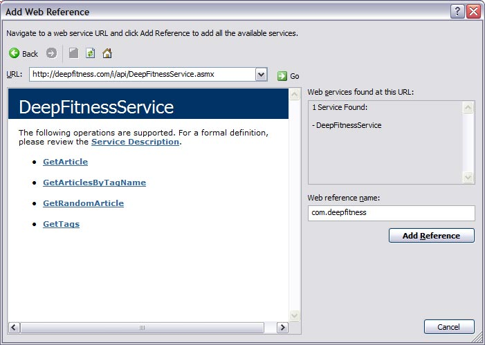

# Consuming a Web Service in `ASP.NET` Tutorial

_Deprecated: The API and website referenced in this article no longer exist._

My fitness site `DeepFitness.com` has almost two thousand articles on fitness and nutrition topics. The other day I wrote an API that exposed a few WebMethods. Below I'm going to walk through setting up a page that consumes those Web Services in an ASP.NET page developed in Visual Studio.

## Add Web Reference

The first step is to Add Web Reference. Either right-mouse click the web site name in the Solution Explorer or from the tool bar select Website. Add the URL `http://deepfitness.com/i/api/DeepFitnessService.asmx` and click the Go button. A Web reference name of com.deepfitness will be found. Click the Add Reference button.



## Web Namespace

Create a new web page. Add the namespace com.deepfitness to the code-behind page.

```csharp
using com.deepfitness;
```

## ASP.NET Code

The lab demo displays three sections which demonstrate three web methods. The drop-down list displays a list of tags used to label the articles on the site. This drop-down is populated using the GetTags call. Once a tag is selected, a datalist is populated with articles for that given tag using the GetArticlesByTagName call. Beside each article title is an articleID. Clicking on that articleID, will call the GetArticle method and return the article title and text below.
```aspx
<h4><em>GetTags</em></h4>
<asp:Label ID="lblTag" AssociatedControlID="ddlTags" runat="server" Text="Tag:" />
<asp:DropDownList ID="ddlTags" runat="server" AutoPostBack="true" />
  
<h4><em>GetArticlesByTagName</em></h4>
<p><asp:Label ID="lblSelectedTagName" runat="server" /></p>
<div style="height:150px; overflow:scroll; background-color:#ffffcc;">
<asp:DataList ID="dlArticles" runat="server">
<HeaderTemplate></HeaderTemplate>
    <ItemTemplate>
    <asp:LinkButton ID="lbtnArticleID" runat="server" 
        CommandArgument='<%# Eval("articleID") %>'
        CommandName="GetArticle"
        OnCommand="LinkButton_Command">
        <%# Eval("articleID") %>
        </asp:LinkButton>
        <%# Eval("title") %><br />
    </ItemTemplate>
    <FooterTemplate></FooterTemplate>
</asp:DataList>
</div>

<h4><em>GetArticle</em></h4>
<p><asp:Label ID="lblTitle" runat="server" /></p>
<div id="dvArticle" runat="server" style="height:150px; overflow:scroll; background-color:#ffffcc;"/>
```

## The C Sharp Code

Both the calls to GetTags and GetArticlesByTagName return collections and can be data bound with a single line of code each. The GetArticle call returns the WebArticleDetails class which holds the article title (Title) and article text (Page).

```csharp
public DeepFitnessService dfs = new DeepFitnessService();

protected void Page_Load(object sender, EventArgs e)
{
    if (!Page.IsPostBack)
    {            
        ddlTags.DataSource = dfs.GetTags();
        ddlTags.DataValueField = "tagName";
        ddlTags.DataBind();
    }
    GetArticlesByTagName();
}

protected void GetArticlesByTagName()
{
    string tagName = ddlTags.SelectedValue;
    dvArticle.InnerHtml = "";
    lblTitle.Text = "";
    lblSelectedTagName.Text = tagName;
    dlArticles.DataSource = dfs.GetArticlesByTagName(tagName);
    dlArticles.DataBind();
}

protected void LinkButton_Command(Object sender, CommandEventArgs e)
{
    int articleID;
    articleID = Convert.ToInt16(e.CommandArgument);
    // get article
    WebArticleDetails article = dfs.GetArticle(articleID);
    lblTitle.Text = article.Title;
    dvArticle.InnerHtml = article.Page;
}
```
_created: August 23, 2007_